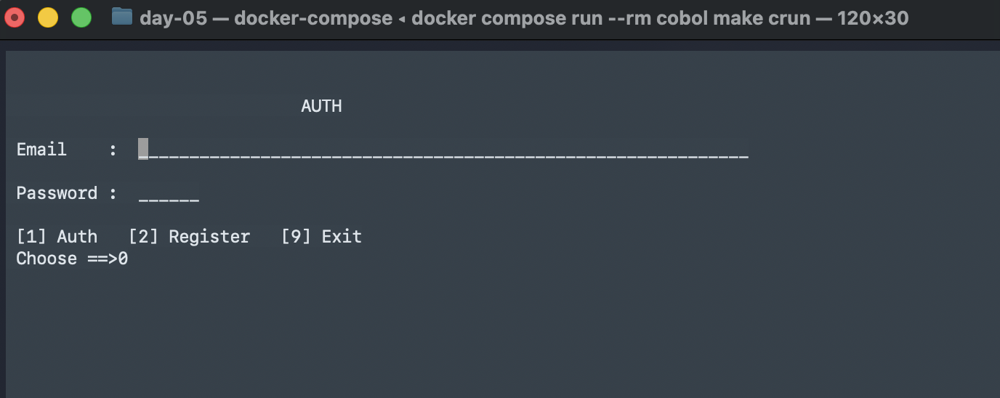
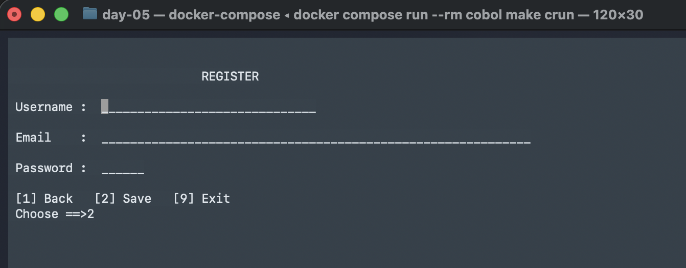
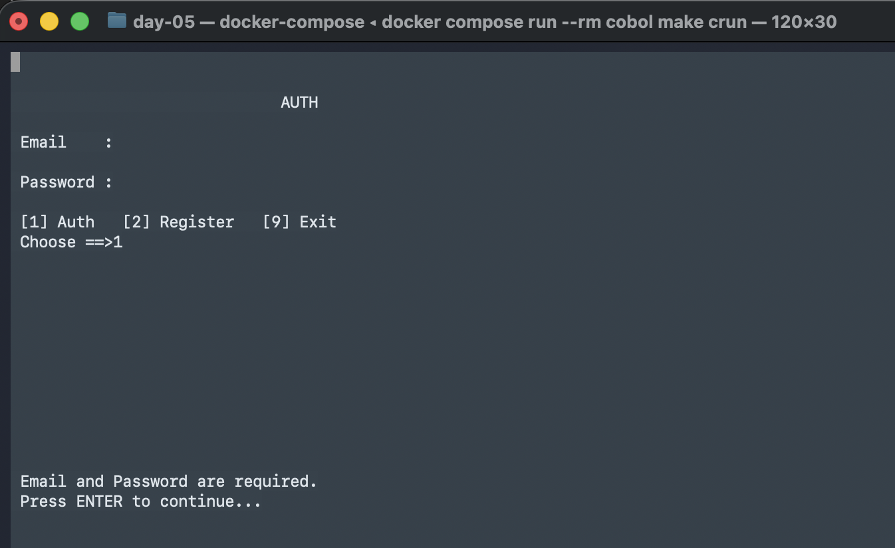
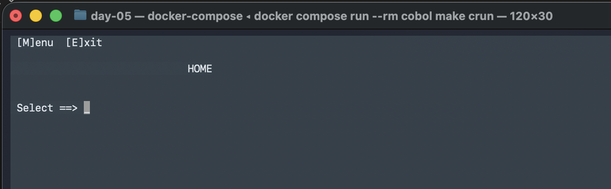

# Day 05 - Free-Form COBOL + SCREEN SECTION UI

## Goal
Move to **free-form COBOL** and build a console UI using the **SCREEN SECTION**. This day focuses on:
- compiling with `-free`
- building simple screens with absolute line/column placement
- basic validations (required fields + menu options)
- navigating between Auth/Register and a simple Home/Menu flow

---

# Key Difference: `-free` compiler flag
In this day we compile with:
```bash
cobc -x -free -o bin/app ...
```

The `-free` flag tells GnuCOBOL to use **free-form syntax**, which removes fixed column rules and allows code to start at any column. That is required for the way these files are written.

You can see it in `cobol/Makefile`:
```makefile
$(COBC) -x -free -o $(BIN)/app \
	$(SRC)/main.cob \
	$(SRC)/modules/auth_register.cob \
	$(SRC)/modules/home.cob
```

---

# New COBOL Section: `SCREEN SECTION`
Instead of manually printing lines with `DISPLAY`, this day uses the `SCREEN SECTION` to define full screens with coordinates.

Example from `auth_register.cob`:
```cobol
SCREEN SECTION.

01  AUTH-SCREEN.
    05 BLANK SCREEN.
    05 LINE 3  COLUMN 30 VALUE "AUTH".
    05 LINE 5  COLUMN 2  VALUE "Email    :".
    05 LINE 5  COLUMN 14 PIC X(60) USING WS-EMAIL.

    05 LINE 7  COLUMN 2  VALUE "Password :".
    05 LINE 7  COLUMN 14 PIC X(6)  USING WS-PASSWORD.
```

- `BLANK SCREEN` clears the console.
- `LINE` and `COLUMN` let you position text and input fields.
- `PIC ... USING` binds a screen input to a working-storage variable.

Accepting a full screen is as simple as:
```cobol
ACCEPT AUTH-SCREEN
```

Inside AUTH-SCREEN we have these input fields:

```cobol
05 LINE 5  COLUMN 14 PIC X(60) USING WS-EMAIL.
05 LINE 7  COLUMN 14 PIC X(6)  USING WS-PASSWORD.
05 LINE 10 COLUMN 12 PIC 9     USING WS-CHOICE.
```

So when we do:
```cobol
ACCEPT AUTH-SCREEN
```

the runtime:
- draws the screen,
- lets the user type into those fields,
- and stores the typed data into: WS-EMAIL, WS-PASSWORD and WS-CHOICE

---

# What this demo does

## 1) Auth / Register UI (`AUTHREG`)
`auth_register.cob` provides two screens:
- **Auth screen** for email/password
- **Register screen** for username/email/password

Users can move between screens with menu choices.

### Validations (simple)
- Auth requires **both email and password**.
- Invalid menu choices show a message.

Example validation in `AUTH-LOOP`:
```cobol
IF WS-EMAIL = SPACES OR WS-PASSWORD = SPACES
    MOVE "Email and Password are required." TO WS-MSG
    PERFORM SHOW-AUTH-MSG
ELSE
    CALL "HOME"
    MOVE "Y" TO WS-DONE
END-IF
```

### Screen switching
```cobol
MOVE "R" TO WS-SCREEN  *> go to Register
MOVE "A" TO WS-SCREEN  *> go back to Auth
```

---

## 2) Home + Menu UI (`HOME`)
`home.cob` shows a very small navigation screen and a menu screen.

- **Home screen**: `M` for Menu, `E` for Exit
- **Menu screen**: options 1, 2, B(ack), E(xit)

It uses the same `SCREEN SECTION` approach to render the UI and prompt for input.

---

# Program Flow
1. `main.cob` calls `AUTHREG`.
2. Auth/Register screens collect user info.
3. Successful Auth calls `HOME`.
4. Home shows a menu and sample options (not implemented).

---

# Compile and Run (from macOS)
```bash
docker compose run --rm cobol make crun
```

# Expected output Screens

Auth Screen using free-form COBOL



Register Screen



Initial validations


Our first MENU


