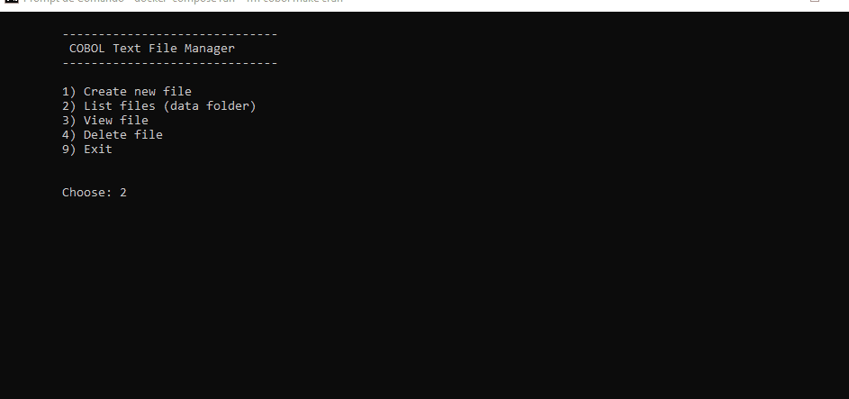

# Day 06 - COBOL Text File Manager

Terminal CRUD-style app in COBOL to manage `.txt` files inside `cobol/data`.
This program demonstrates how to use the FILE-CONTROL section and basic file I/O operations, including:
- creating a new text file
- checking whether a file exists
- listing files in a directory
- reading and displaying file contents
- viewing file contents with pagination

## Run
From `day-06` folder:

```bash
docker compose run --rm cobol make crun
```

## What the program does (`src/main.cob`)
Program name: `FILE-MENU`

Main menu options:
- `1` Create new file
- `2` List files from `data/`
- `3` View file
- `4` Delete file (with confirmation)
- `9` Exit

## File naming and path
- Just need to enter the base file name (without extension).
- The app always builds the path as: `data/<name>.txt`.
- Empty file names are rejected.

## Create flow
- Opens file in output mode and writes user content.
- Input screen accepts up to 10 lines per page.
- A line containing only `.` finishes input immediately.
- Blank lines are ignored (not written).
- If no dot is entered, app asks whether to add 10 more lines.

## List flow
- Uses system command to list: `data/*.txt`.
- Shows up to 15 file paths on screen.
- If no file exists, displays: `No .txt files found in data/.`

## View flow
- Opens selected file and shows content in pages of 15 lines.
- Each displayed line is truncated to 80 chars.
- Navigation: `[N]` next page, `[Q]` quit.
- If file cannot be opened: `File not found or empty.`

## Delete flow
- Asks confirmation (`Y/N`) before removing the file.
- Validates file exists before deletion.
- Executes system delete (`rm -f <path>`).

## Project structure
- `day-06/cobol/src/main.cob`: program source.
- `day-06/cobol/data/`: managed text files.
- `day-06/cobol/Makefile`: build and run targets.

## App



