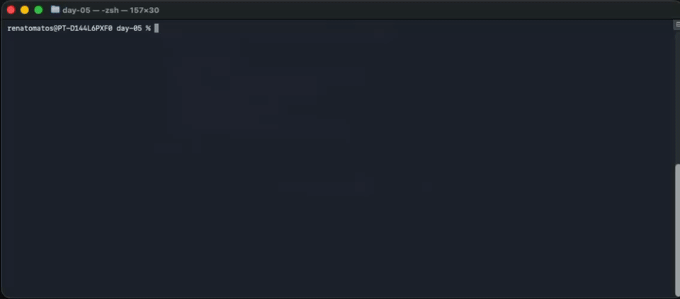

# Day 07 - Free-Form COBOL + PostgreSQL Authentication + Register new users

## Goal
Extend the console UI from Day 05 with **real database authentication** using PostgreSQL. This day focuses on:
- free-form COBOL (`-free`)
- `SCREEN SECTION` UI
- validating auth/register **against a real DB**
- SQL execution via `psql` inside the container
- Introduction to the File Control Section

---

# Architecture Overview
- **UI**: `auth_register.cob` + `home.cob` (SCREEN SECTION)
- **DB access**: `db_exec.cob` (executes SQL using `psql`)
- **Auth**: `db_auth_user.cob` (validates credentials)
- **Register**: `db_register_user.cob` (creates new users)
- **Database**: PostgreSQL container initialized by `db/init.sql`

---

# Free-Form Compilation (`-free`)
All COBOL modules are compiled in free-form style:
```bash
cobc -x -free -o bin/app ...
```

See `cobol/Makefile`:
```makefile
$(COBC) -x -free -o $(BIN)/app \
	$(SRC)/main.cob \
	$(SRC)/modules/auth_register.cob \
	$(SRC)/modules/home.cob \
	$(SRC)/modules/db_exec.cob \
	$(SRC)/modules/db_auth_user.cob \
	$(SRC)/modules/db_register_user.cob
```

---

# Database Setup
PostgreSQL is started via `docker-compose.yml`. It creates the database on first run:

- `POSTGRES_USER`: `cobol`
- `POSTGRES_PASSWORD`: `cobolpass`
- `POSTGRES_DB`: `coboldb`

The schema is loaded from `db/init.sql`:
- enables `pgcrypto`
- creates `users` table with unique `email` and `username`

---

# How a database execution runs (`DBEXEC`)
`DBEXEC` writes SQL Command to `/tmp/query.sql`, executes it with `psql` command line, and reads the first output line.

This keeps SQL handling simple for COBOL:
- write SQL string to file
- run `psql -tA -f` (https://www.postgresql.org/docs/current/app-psql.html)
- read first line from `/tmp/db_out.txt` (where sql command output content is stored)


## Let´s breakdown db_exec.cob flow

```cobol
ENVIRONMENT DIVISION.
INPUT-OUTPUT SECTION.
FILE-CONTROL.
    SELECT SQLFILE ASSIGN TO WS-SQLFILE
        ORGANIZATION IS LINE SEQUENTIAL.
    SELECT OUTFILE ASSIGN TO WS-OUTFILE
        ORGANIZATION IS LINE SEQUENTIAL.

DATA DIVISION.
FILE SECTION.

FD SQLFILE.
01 SQLLINE PIC X(300).

FD OUTFILE.
```

1) `SELECT SQLFILE` ... declares a logical file name SQLFILE that our COBOL program will use in OPEN/WRITE/CLOSE operations.
2) `ASSIGN TO WS-SQLFILE means`: the real OS filename will come from the variable WS-SQLFILE (here: /tmp/query.sql).
3) `LINE SEQUENTIAL means`: treat the file as text lines, where each WRITE is one line and each READ returns one line (like reading a text file line-by-line).

Most COBOL compilers (including GnuCOBOL) expect that every file named in FILE-CONTROL has a corresponding FD entry in the FILE SECTION.
In out case we have (in/out) files
- SELECT SQLFILE... 
- SELECT OUTFILE...ul

Due that, we also need the corresponding FD sections:
- FD SQLFILE.
- FD OUTFILE.

Let me try to rephrase what this command is doing here:

- I have a file handle called SQLFILE. When I open it, use the path stored in WS-SQLFILE, and treat it as a line-based text file.

Same for OUTFILE, WS-OUTFILE (/tmp/db_out.txt).

So then, we have the `FILE SECTION`

1) FD = File Description. It defines the record layout for that file (in our case the layout is just a simple line content).
2) 01 SQLLINE PIC X(300) is the “buffer” record used for WRITE SQLLINE during the READ SQLFILE operation
3) For OUTFILE, this would be the record buffer if we did READ OUTFILE INTO ....

How the whole module flows (step-by-step)?

- Using db_auth_user.cob we have `CALL "DBEXEC" USING WS-SQL WS-DB-OUTPUT`
- Caller passes L-SQL (the SQL text stored into WS-SQL variable).
- This program returns (output sql command) storing the SQL Command Output using an output file and returns the first line content using `L-FIRST-LINE` (first line of psql output).

We are going to reuse this module across these screens: User Authentication and Registration.
Once the operation runs in the user terminal, the user is either auth or registering tasks one by one.
It means, this file flow must be enough for our test case.

---

# Auth Flow (`DBAUTH`)
On Auth screen, option `[1]` calls `DBAUTH`:
1. Checks that email and password are not blank.
2. Runs SQL to check if the user exists and the password matches.
3. Uses `pgcrypto` and `crypt()` to verify the hash.

If valid, it navigates to `HOME`. If not, it shows an error.

---

# Register Flow (`DBREGISTER`)
On Register screen, option `[2]` calls `DBREGISTER`:
1. Validates all fields are provided.
2. Checks if email or username already exists.
3. Inserts a new user with `bcrypt` (`gen_salt('bf')`).

If successful, it navigates to `HOME`. Otherwise, it shows the error message.

---

# UI (SCREEN SECTION)
The console UI is still driven by `SCREEN SECTION` with absolute line/column placement, just like Day 05. 
The difference is **actions now call DB modules** instead of placeholder logic.

---

# Compile and Run (from macOS)
```bash
# Start PostgreSQL in the background
docker compose up -d postgres

# Build and run the COBOL app
docker compose run --rm cobol make crun
```


# Quick demo 

